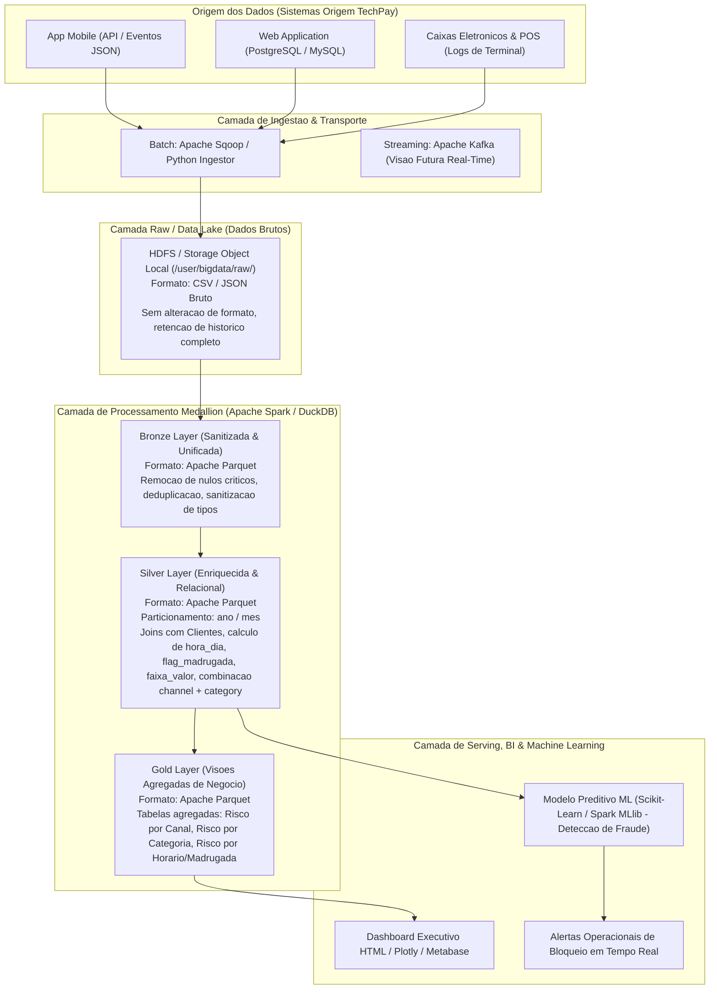

# Etapa 1 — Arquitetura de Big Data (Diagrama)

## Diagrama da Arquitetura Medallion da TechPay

---

## Resumo dos Formatos e Particionamento por Camada

| Camada | Formato de Arquivo | Compressao | Estrategia de Particionamento | Justificativa Tecnica |
|---|---|---|---|---|
| **Raw** | CSV / JSON | Nenhuma / Snappy | Nenhuma (Estrutura por diretorio de origem) | Preserva a fidelidade exata do dado de origem para auditoria. |
| **Bronze** | Apache Parquet | Snappy | Nenhuma | Formato colunar otimizado para leitura veloz durante a limpeza. |
| **Silver** | Apache Parquet | Snappy | `ano` / `mes` | Permite *Partition Pruning* em consultas temporais de compliance e risco. |
| **Gold** | Apache Parquet | Snappy | `ano` (se volume for alto) ou Tabela Unica | Agregados pre-calculados de alto desempenho para dashboards executivos. |
